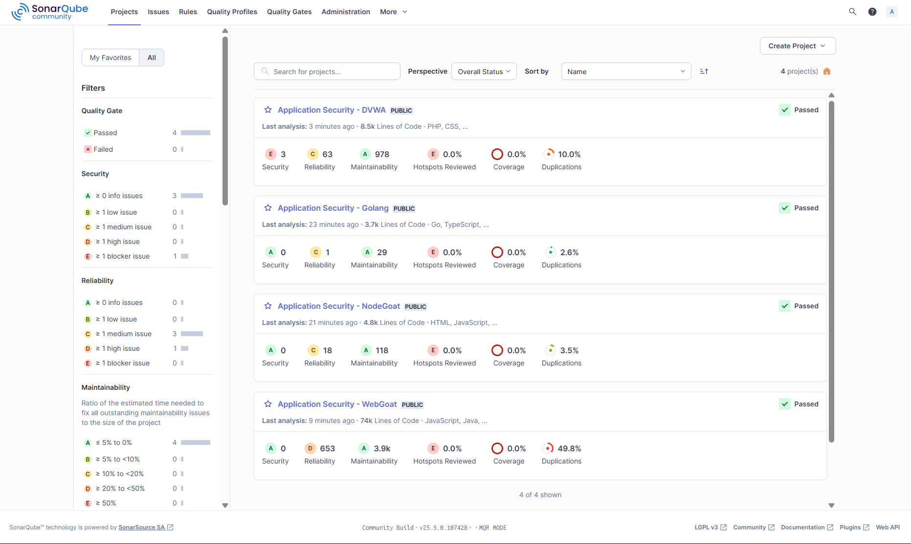

# Appliaction Security - SAST Comparison

## 🏗️ Architecture

```
┌─────────────────┐    ┌─────────────────┐    ┌─────────────────┐
│   SonarQube     │    │     Semgrep     │    │      DVWA       │
│   (Port 9000)   │    │    Scanner      │    │   (Port 8080)   │
└─────────────────┘    └─────────────────┘    └─────────────────┘
         │                       │                       │
         └───────────────────────┼───────────────────────┘
                                 │
                    ┌─────────────────┐
                    │  Source Code    │
                    │   Repository    │
                    └─────────────────┘
```

## 🚀 Quick Start

### 1. Setup Directory Structure
```bash
# Create project directory
mkdir security-lab && cd security-lab

# Create required directories
mkdir -p {code,reports,sample-app,dvwa-source}
```

### 2. Create Files

```
security-lab/
├── docker-compose.yml
├── sonar-scanner.properties
├── setup.sh
├── sample-app/
│   ├── Dockerfile
│   ├── server.js
│   └── package.json
├── code/
└── reports/
```

### 3. Launch Environment
```bash
# Make setup script executable
chmod +x setup.sh

# Run setup (this will start all services and run initial scans)
./setup.sh

# Or manually start services
docker-compose up -d
```

## 🔧 Services Overview

| Service | Port | Purpose | Credentials |
|---------|------|---------|-------------|
| SonarQube | 9000 | Code quality & security analysis | admin/admin |
| DVWA | 8080 | Vulnerable web application | admin/password |
| Sample App | 3000 | Custom vulnerable Node.js app | - |
| Semgrep | - | Static analysis scanner | - |
| PostgreSQL | - | SonarQube database | - |
| MySQL | - | DVWA database | - |

## 🎯 Assignment Execution

### Semgrep Scans
```bash
# General security scan
docker exec semgrep-scanner semgrep --config=auto /src

# OWASP Top 10 focused scan
docker exec semgrep-scanner semgrep --config=p/owasp-top-ten /src

# Language-specific scans
docker exec semgrep-scanner semgrep --config=p/php /src/DVWA
docker exec semgrep-scanner semgrep --config=p/nodejs /src/NodeGoat

# Output to JSON for analysis
docker exec semgrep-scanner semgrep --config=p/security-audit /src --json --output=/reports/semgrep-results.json
```

### SonarQube Scans
```bash
# Scan DVWA
docker exec sonar-scanner sonar-scanner \
  -Dsonar.projectKey=dvwa-analysis \
  -Dsonar.sources=/usr/src/DVWA \
  -Dsonar.host.url=http://sonarqube:9000 \
  -Dsonar.login=admin \
  -Dsonar.password=admin

# Scan NodeGoat
docker exec sonar-scanner sonar-scanner \
  -Dsonar.projectKey=nodegoat-analysis \
  -Dsonar.sources=/usr/src/NodeGoat \
  -Dsonar.host.url=http://sonarqube:9000 \
  -Dsonar.login=admin \
  -Dsonar.password=admin
```

### Custom Rule Testing
```bash
# Test custom Semgrep rules
docker exec semgrep-scanner semgrep --config=/path/to/custom-rules.yml /src

# Configure custom SonarQube quality profiles
# Access: SonarQube Dashboard > Quality Profiles
```

### Export Results for Comparison
```bash
# Export Semgrep results in different formats
docker exec semgrep-scanner semgrep --config=auto /src --sarif --output=/reports/semgrep.sarif
docker exec semgrep-scanner semgrep --config=auto /src --csv --output=/reports/semgrep.csv

# SonarQube API for programmatic access
curl -u admin:admin "http://localhost:9000/api/issues/search?componentKeys=dvwa-analysis"
```

## Results
